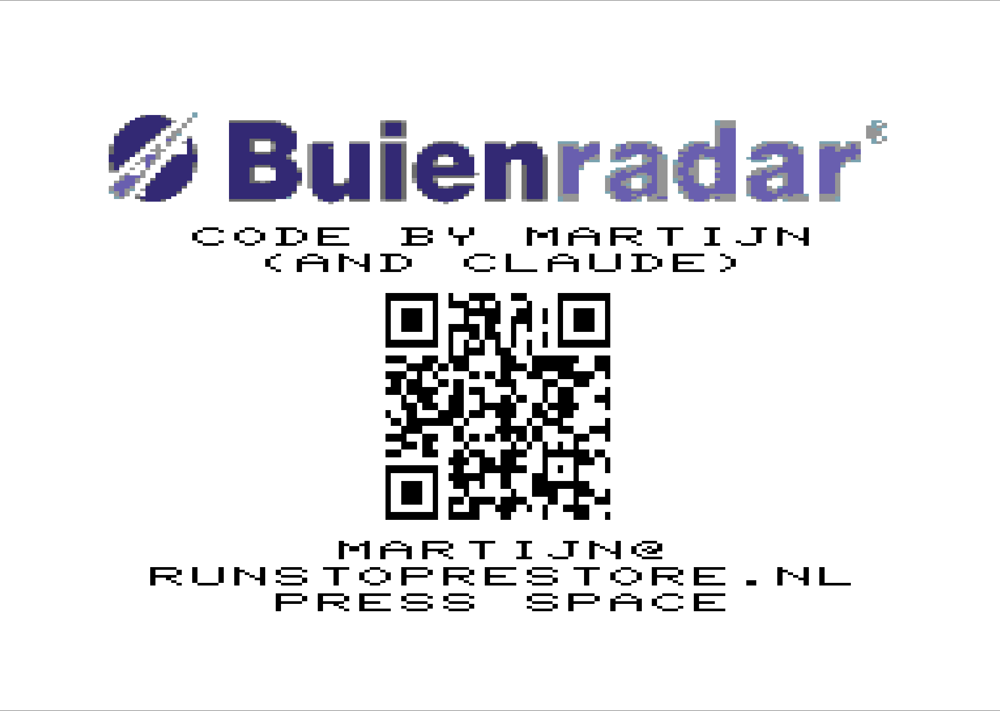
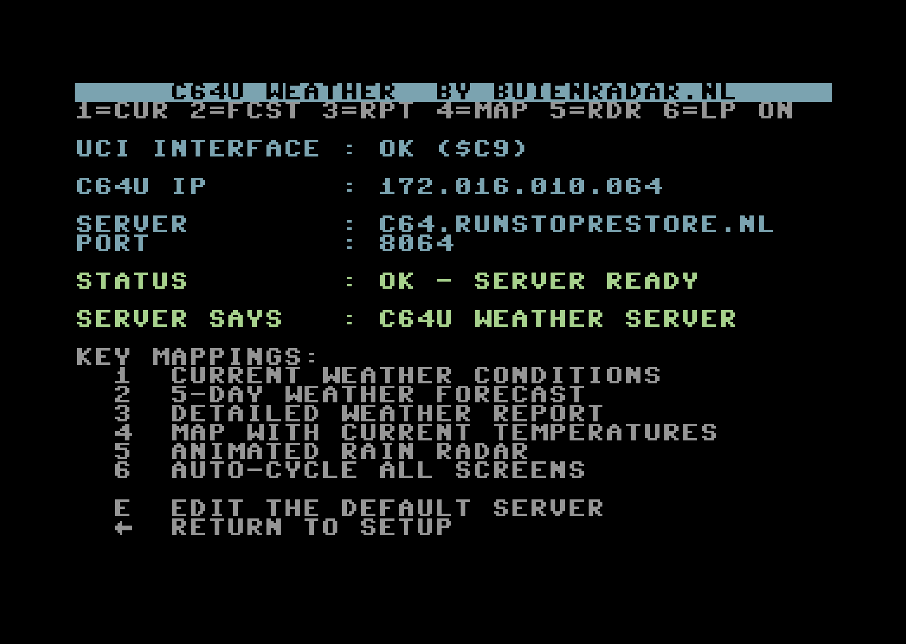
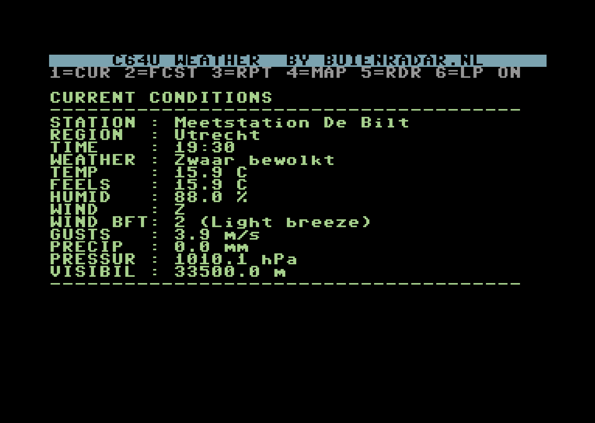
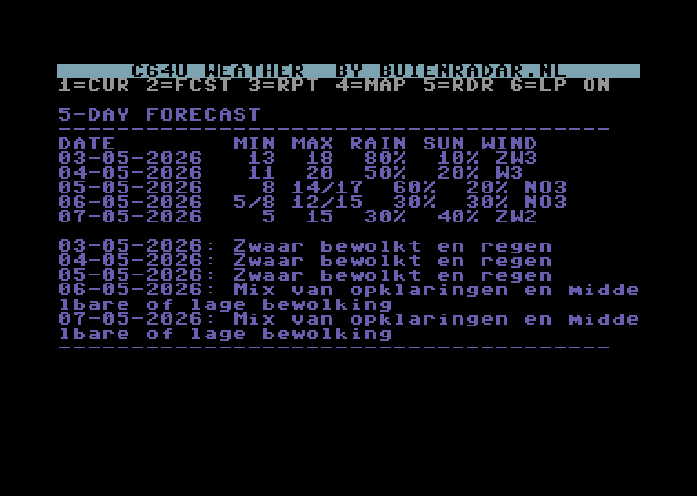
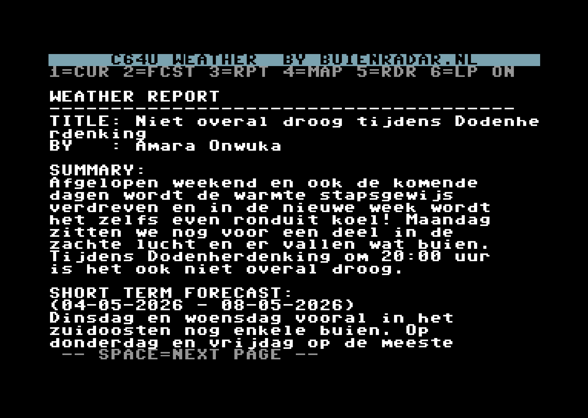
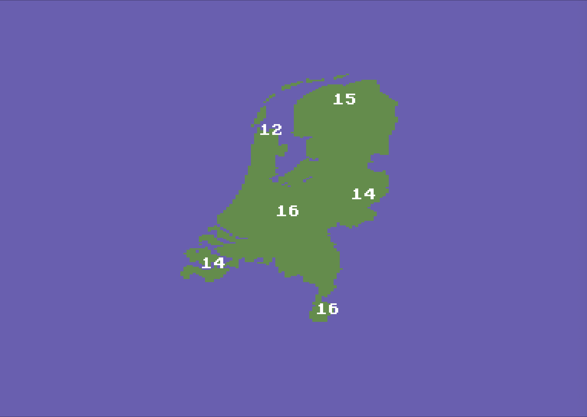
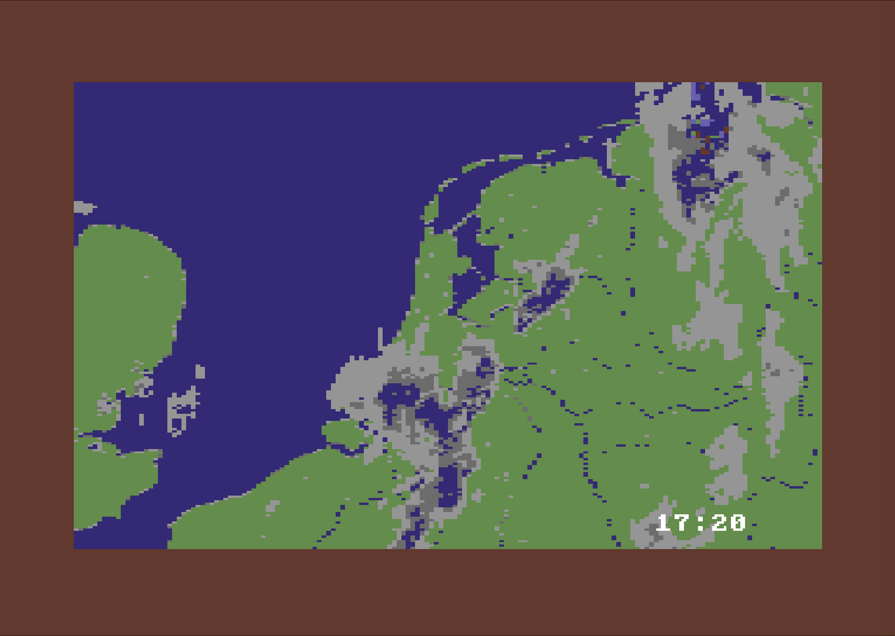

# C64U Weather

A live weather display program for the **Commodore 64 Ultimate**, leveraging the Ultimate Command Interface (UCI) and it's Network Target (also present on the **Ultimate** series mainboards and the **Ultimate 64 & II+** cartridges). The C64 opens a raw TCP socket through the UCI, makes a plain HTTP/1.0 GET request to a local Python proxy server, and renders weather data, an interactive Netherlands temperature map, and an animated rain-radar slideshow — all in native C64 graphics.



---

## Features

- **Server setup** — enter a custom hostname and port from the setup screen or use the default hosted option at c64.runstoprestore.nl
- **Current conditions** — live temperature, humidity, wind, precipitation, pressure, visibility
- **5-day forecast** — min/max temp, rain chance, sun hours, wind direction and Beaufort scale
- **Weather report** — full-text bulletin from Buienradar, paginated across screens
- **Temperature map** — Netherlands outline in VIC-II multicolour bitmap mode with hardware sprites for six cities (Utrecht, Maastricht, Den Helder, Groningen, Vlissingen, Twente). Sprites alternate every 3 seconds between the current temperature and a weather-state icon (sun, partly cloudy, cloudy, fog, rain, snow, thunder, plus moon and partly-cloudy-night variants for after-dark conditions)
- **Animated radar** — multi-frame rain-radar slideshow fetched from the proxy, shown with frame timestamps as sprites
- **Auto-cycle mode** — hands-free carousel through all screens


---

## Architecture

```
Commodore 64  (weather.asm — 6502 assembly)
  │
  │  UCI Network Target ($03) — raw TCP socket
  │  Ultimate II+/U64 firmware handles all TCP/IP
  │
  ▼
Python proxy  (server.py — HTTP on configurable port, LAN only)
  │
  │  HTTPS (SSL terminated by Python)
  ▼
data.buienradar.nl  (~32 KB JSON)   +   api.buienradar.nl  (radar PNG frames)
  └─► distilled to plain ASCII / raw Koala frames for the C64
```

The proxy is required for two reasons:

1. **SSL** — the C64U cannot perform TLS via the network target; the proxy terminates it.
2. **Format translation** — Buienradar returns large JSON and PNG images. The proxy extracts relevant fields, word-wraps to 38 columns, and converts radar frames to C64 Koala (multicolour bitmap) format.

---

## Repository contents

| File | Purpose |
|------|---------|
| `weather.asm` | Main C64 6502 assembly source (KickAssembler syntax) |
| `weather.prg` | Compiled C64 executable (BASIC loader + machine code) |
| `server.py` | Python proxy server |
| `make_splash.py` | Generates `splash.kla` from `Buienradar.svg.png` + C64 chargen ROM |
| `Buienradar.svg.png` | Buienradar logo used by `make_splash.py` |
| `requirements.txt` | Python dependencies for the proxy server |
| `Dockerfile` | Docker image for running the proxy |
| `KickAss.jar` | KickAssembler v5.25 — assembles `.asm` → `.prg` |

---

## Requirements

### C64 hardware
- Commodore 64U or Commodore 64 with **Ultimate II+** or **U64** cartridge
- Ultimate firmware **≥ 3.10** (for the Network Target, `$03`)

### Proxy server *(self-hosting only — not needed if you use the default hosted server)*
- Python **3.10** or newer
- Dependencies: `pip install -r requirements.txt` (Pillow, gunicorn)

### Rebuilding the PRG
- Java runtime (for KickAssembler)
- C64 chargen ROM at the path configured in `make_splash.py` (only needed to regenerate the splash screen)

---

## Quick start

> **Just want to run it?** Load `weather.prg` on your C64 and use the default hosted server — no proxy setup required. In the settings of your Ultimate go to **MEMORY & ROMS** and set the **Command Interface** to enabled. Then skip straight to step 2.

### 1. (Optional) Run your own proxy server

A public proxy is already running at **c64.runstoprestore.nl** and is pre-configured as the default server address. You only need to run `server.py` yourself if you want to host it locally, change the weather station, or run it without an internet dependency.

**Option A — plain Python:**

```bash
cd C64U_Weather
pip install -r requirements.txt
python3 server.py           # listens on port 8064 by default
python3 server.py --port 9000 --station 6260   # override port / station
```

**Option B — Docker (hardened, recommended for self-hosting):**

```bash
cd C64U_Weather
docker compose up -d --build
```

Listens on port **8064**. Set `STATION_ID` in `docker-compose.yml` to use a different Buienradar station.

### 2. Load the PRG on the C64

Copy `weather.prg` to a USB stick, mount via the Ultimate menu, and `LOAD`/`RUN` it, or use the Ultimate's built-in file browser to run it directly.

### 3. Configure the server address *(only if running your own proxy)*

On the setup screen press **E** to edit the server address and port. Enter the LAN IP of the machine running `server.py` followed by `:port`. If you are using the default hosted server this step is not needed.

---

## User interface

### Splash screen


Shown at boot. Displays the Buienradar logo, a credits line, and a scannable QR code that links directly to this GitHub repository. **Press Space** to continue to the setup screen.

---

### Setup screen



Shown after the splash while the program verifies connectivity. Displays the UCI cartridge status, the device's LAN IP, the configured server hostname and port, and the result of a live connection test. Press **E** to edit the server address, or **← (back-arrow)** to return here from any screen.

| Line | Content |
|------|---------|
| UCI INTERFACE | `OK ($C9)` when the Control Interface is enabled |
| C64U IP | LAN IP of the cartridge as reported by firmware |
| SERVER | Hostname of the proxy server |
| PORT | Port of the proxy server |
| STATUS | `TESTING CONNECTION…` → `OK – SERVER READY` or `FAIL – NO RESPONSE` |
| SERVER SAYS | First line returned by the server's `/` endpoint |

---

### 1 — Current conditions



Live weather snapshot for the configured station: temperature, feels-like, humidity, wind direction and Beaufort force, gusts, precipitation, air pressure, and visibility. Data is fetched fresh on every keypress.

---

### 2 — 5-day forecast



Tabular overview of the coming five days showing minimum and maximum temperature, rain chance, sun percentage, and wind. Followed by a one-line summary for each day.

---

### 3 — Weather report



Full-text weather bulletin from Buienradar, word-wrapped to 38 columns. If the report is longer than one screen, **press Space** to advance to the next page.

---

### 4 — Temperature map



The Netherlands rendered in VIC-II multicolour bitmap mode. Hardware sprites overlay six weather stations: Utrecht, Maastricht, Den Helder, Groningen, Vlissingen, and Twente. Each sprite alternates every 3 seconds between two states:

- **Temperature** — current temperature in degrees Celsius, built at runtime from a 5×7 pixel font (negative values get a leading minus sign).
- **Weather-state icon** — one of nine 24×21 pixel icons representing current conditions: sun, partly cloudy, cloudy, fog, rain, snow, thunder, moon (clear nights), or partly-cloudy-night (moon behind cloud). Icons are colourised per type (yellow sun, white clouds/rain/snow/thunder/moon, light grey fog).

---

### 5 — Animated rain radar



A 12-frame rain-radar slideshow covering the last hour (one frame every 5 minutes), served by the proxy, which fetches, scales, and converts Buienradar radar PNGs to C64 Koala format on the fly. Each frame is displayed with a timestamp sprite. Press any key to return to the main loop.

---

### Key mappings

| Key | Action |
|-----|--------|
| `1` | Current weather conditions |
| `2` | 5-day weather forecast |
| `3` | Detailed weather report (paginated, Space to advance) |
| `4` | Temperature map (Netherlands with city sprites) |
| `5` | Animated rain radar |
| `6` | Auto-cycle all screens (toggle ON/OFF) |
| `E` | Edit the default server address |
| `←` (back-arrow) | Return to setup screen |
| `RUN/STOP` | Quit to BASIC |

---

## Proxy server API

All responses are plain ASCII, max 38 characters wide. 

| Endpoint | Description |
|----------|-------------|
| `GET /` | Help text |
| `GET /current` | Current conditions |
| `GET /forecast` | 5-day forecast |
| `GET /report` | Full weather report text |
| `GET /temps` | Six city temperatures and six weather-icon indices for the temperature map |
| `GET /radar` | Rain-radar frames as a sequence of raw Koala blocks |

### Example — `/current`

```
CURRENT CONDITIONS
--------------------------------------
STATION : MEETSTATION DE BILT
REGION  : UTRECHT
TIME    : 14:20
WEATHER : GEDEELTELIJK BEWOLKT
TEMP    : 16.0 C
FEELS   : 15.0 C
HUMID   : 55.0 %
WIND    : ZW
WIND BFT: 3 (GENTLE BREEZE)
GUSTS   : 7.2 M/S
PRECIP  : 0.0 MM
PRESSUR : 1018.4 HPA
VISIBIL : 35000.0 M
--------------------------------------
```

### Example — `/temps`

Twelve newline-terminated lines: six signed integer temperatures (city order: Utrecht, Maastricht, Den Helder, Groningen, Vlissingen, Twente) followed by six icon indices (`0`–`8`). The C64 reads the first six as digits for the temperature sprites and the next six as pointers into the weather-icon sprite table.

```
16
17
14
13
15
16
2
4
0
1
2
7
```

Icon indices: `0` sun, `1` partly cloudy, `2` cloudy, `3` fog, `4` rain, `5` snow, `6` thunder, `7` moon (clear at night), `8` partly cloudy at night (moon behind cloud).

---

## Building from source

### Compile the PRG

```bash
cd C64U_Weather
java -jar KickAss.jar weather.asm
# Produces: weather.prg
```

### Regenerate the splash screen

`make_splash.py` reads `Buienradar.svg.png`, renders text using the real C64 chargen ROM, generates a QR code for the GitHub URL, and converts everything to Koala format:

```bash
pip install pillow qrcode
python3 make_splash.py
# Produces: splash.kla, splash_preview.png
```

Edit `CHARGEN_PATH` near the top of `make_splash.py` to point to your C64 chargen ROM (e.g. from a VICE installation).

---

## C64 program — technical reference

### Memory map

```
$0801–$0808   8 B     BASIC upstart (SYS 2062)
$080E–$1E94   ~6 KB   Machine code (main + subroutines + data tables)
$1E95–$3DD4   8000 B  koala_data bitmap (Netherlands map, embedded)
$3DD5–$41BC   1000 B  koala_data screen RAM
$41BD–$456B   1000 B  koala_data colour RAM
$456C         1 B     koala_data background colour
$456D–$6C7D   10001 B splash_data (Koala splash screen, embedded)

── VIC bank 1 ($4000–$7FFF, active during bitmap/map/radar/splash) ──
$4000–$43E7   1000 B  Screen RAM for multicolour bitmap mode
$43F8–$43FD   6 B     Sprite pointers (sprites 0–5, values $70–$75)
$5C00–$5D7F   384 B   Sprite data (6 × 64 B temperature sprites)
$6000–$7F3F   8000 B  Bitmap data (multicolour 160×200)

── VIC bank 0 ($0000–$3FFF, active during text mode) ──
$0400–$07FF   1000 B  Text-mode screen RAM
$1000–$17FF          Character ROM shadow (VIC sees chargen here)

── RAM buffers ($C000–$CFD1) ──
$C000–$C3FF   1024 B  RXBUF  (HTTP receive buffer)
$C400–$C7FF   1024 B  STBUF  (HTTP request assembly / scratch)
$C800–$C801   2 B     (margin)
$C802–$CBE9   1000 B  MAP_SRAM_BUF (safe copy of Koala screen RAM)
$CBEA–$CFD1   1000 B  MAP_CRAM_BUF (safe copy of Koala colour RAM)
```

### Zero-page variables

| Label | Address | Purpose |
|-------|---------|---------|
| `ZP_COL` | `$61` | Current display column (0–39) |
| `ZP_ROW` | `$62` | Current display row (0–24) |
| `ZP_DCOL` | `$63` | Current text colour |
| `ZP_RXPTR` | `$64` | Receive buffer pointer low |
| `ZP_RXHI` | `$65` | Receive buffer pointer high |
| `ZP_TMP` | `$66` | Scratch pointer low |
| `ZP_TMPH` | `$67` | Scratch pointer high |
| `ZP_DECB` | `$68` | Decimal conversion scratch |
| `IP0–IP3` | `$69–$6C` | Device IP address (from `get_ip`) |
| `ZP_SOCK` | `$6D` | Active TCP socket handle |
| `ZP_LFCNT` | `$6E` | Consecutive LF counter (header stripping) |
| `ZP_PHASE` | `$6F` | `do_get_binary` receive phase |
| `ZP_CNTLO/HI` | `$70–$71` | `do_get_binary` remaining byte count |
| `ZP_CHAR0/1` | `$72–$73` | Temperature sprite digit indices |
| `ZP_PGFULL` | `$74` | Page-full flag (set by `next_row` on overflow) |
| `ZP_PTR/PTRH` | `$FB–$FC` | URL path / string pointer |

### UCI register map

Registers live in the cartridge I/O area at `$DF1C–$DF1F`:

| Label | Address | Dir | Purpose |
|-------|---------|-----|---------|
| `UCI_STAT` / `UCI_CTRL` | `$DF1C` | R/W | Status flags / control commands |
| `UCI_ID` / `UCI_CMD` | `$DF1D` | R/W | Cartridge ID (`$C9`) / command bytes |
| `UCI_DATA` | `$DF1E` | R | Response data FIFO |
| `UCI_SDATA` | `$DF1F` | R | Status string FIFO |

**Control bits (write to `UCI_CTRL`):**

| Constant | Value | Meaning |
|----------|-------|---------|
| `PUSH_CMD` | `$01` | Dispatch assembled command to firmware |
| `DATA_ACC` | `$02` | Acknowledge / release data FIFOs |

**Status bits (read from `UCI_STAT`):**

| Mask | Constant | Meaning |
|------|----------|---------|
| `$30` | `STATE_MASK` | Isolate state field |
| `$00` | `STATE_IDLE` | Ready for new command |
| `$10` | `STATE_BUSY` | Still processing |
| `$40` | `STAT_AV` | Status FIFO has data |
| `$80` | `DATA_AV` | Data FIFO has data |

### UCI Network Target commands

All networking uses **target `$03`**:

| Constant | Opcode | Command bytes | Response |
|----------|--------|---------------|----------|
| `NET_IPADDR` | `$05` | `$03 $05 <iface>` | 12 B: IP + netmask + gateway |
| `NET_TCPCON` | `$07` | `$03 $07 <portlo> <porthi> <host\0>` | 1-byte socket + status string |
| `NET_CLOSE` | `$09` | `$03 $09 <socket>` | Status string |
| `NET_READ` | `$10` | `$03 $10 <socket> <lenlo> <lenhi>` | 2-byte count + data |
| `NET_WRITE` | `$11` | `$03 $11 <socket> <data…\0>` | Status string |

`NET_READ` returns `$FF $FF` (65535) when no data is available yet; `$00 $00` signals connection closed.

### Key routines

#### Startup

| Routine | Description |
|---------|-------------|
| `presave_map_bufs` | Saves `koala_data+8000` → `MAP_SRAM_BUF` and `koala_data+9000` → `MAP_CRAM_BUF`. **Must** run before `show_splash` because the splash bitmap write to `$4000–$5F3F` would otherwise destroy the Koala screen/colour RAM stored at `$3DD5–$456B`. |
| `show_splash` | Copies `splash_data` to VIC bank 1, switches to multicolour bitmap mode, waits for Space, then calls `restore_char_mode`. |
| `copy_koala_to_ram` | Applies the pre-saved map buffers to `$4000` (screen RAM) and `$D800` (colour RAM), then copies the Koala bitmap from `koala_data` to `$6000`. Saves `map_bgcolor`. |
| `startup_diag` | Verifies UCI, reads device IP, shows server details, tests connection to `/`. On success returns immediately; on failure waits for a keypress. |

#### Screen output

| Routine | Description |
|---------|-------------|
| `cls` | Clears all 1000 screen + 1000 colour RAM cells. |
| `cls_data` | Clears rows 2–24 only (preserves title/menu bars). |
| `put_char` | Writes screen code A at (`ZP_ROW`, `ZP_COL`) with colour `ZP_DCOL`. Auto-advances column; wraps via `next_row`. |
| `pstr` | Prints a null-terminated ASCII string through `a2s` + `put_char`. |
| `pstr_rev` | Like `pstr` but each screen code is ORed with `$80` (reverse video). |
| `show_rx` | Walks `RXBUF`, printing each character; CR skipped, LF → `next_row`. |
| `show_rx_paged` | Like `show_rx` but pauses every 23 rows for Space to advance. |
| `a2s` | Converts ASCII to C64 screen code: `$40–$5F` → subtract `$40`; `$61–$7A` → subtract `$60`; `$00–$3F` → unchanged; others → `?`. |
| `restore_char_mode` | Clears bitmap mode, clears multicolour, switches VIC back to bank 0, restores `$D018 = $16`. |

#### Networking

| Routine | Description |
|---------|-------------|
| `do_get` | Complete HTTP/1.0 GET cycle: open TCP socket, send request, receive body into `RXBUF`, strip headers, close socket. Carry set on error. |
| `do_get_binary` | Like `do_get` but receives a fixed-length binary payload (e.g. a Koala frame) directly into a specified RAM buffer rather than `RXBUF`. |
| `get_ip` | Issues `NET_IPADDR`; stores first four response bytes into `IP0–IP3`. |
| `strip_headers` | Scans `RXBUF` for `\n\n`; copies body to start of `RXBUF` and null-terminates. |

#### Page display

| Routine | Description |
|---------|-------------|
| `page_current` | `do_get("/current")` → `show_rx` in light green |
| `page_forecast` | `do_get("/forecast")` → `show_rx` in light blue |
| `page_report` | `do_get("/report")` → `show_rx_paged` in white |
| `page_map` | Restores Koala bitmap/screen/colour RAM, switches to multicolour bitmap mode, fetches `/temps`, parses five temperatures, renders sprite overlays for each city. |
| `page_radar` | Fetches successive Koala frames from `/radar`, copies each to `$6000`, and displays it with a frame-timestamp sprite. Loops until a key is pressed. |

#### Temperature map sprites

Six 24×21 pixel hardware sprites overlay the map. Each sprite slot alternates every 3 seconds between two pointers:

- **Temperature labels** — built at runtime by `render_temp_sprite` from a 5×7 pixel digit font (with negative-sign prefix for sub-zero values). Sprite data is written to `$5C00–$5D7F` (VIC bank 1, pointers `$70`–`$75`).
- **Weather-state icons** — nine pre-rendered 64-byte sprites copied to `$4400–$463F` at startup (pointers `$10`–`$18`): sun, partly cloudy, cloudy, fog, rain, snow, thunder, moon, partly-cloudy-night. Per-icon colours come from the `icon_colors` lookup table and are written to `$D027–$D02C` on each swap.

`pm_check_alt_timer` ticks the C64 jiffy clock (`$A0–$A2`) and `pm_swap_sprites` flips the six sprite pointers and colours between the two states. The active icon for each city is selected from `city_icons[]`, populated from the icon indices returned by the proxy's `/temps` endpoint. Six stations map to fixed screen positions and sprite slots 0–5: Utrecht, Maastricht, Den Helder, Groningen, Vlissingen, Twente.

---

## Implementation notes

### VIC bank management

The program uses two VIC banks:

- **Bank 0** (`$0000–$3FFF`, `$DD00` bits `= $03`): text mode. Screen RAM at `$0400`, character ROM shadow at `$1000`.
- **Bank 1** (`$4000–$7FFF`, `$DD00` bits `= $02`): bitmap/map/radar/splash. Bitmap at `$6000` (`$D018` offset `$2000`), screen RAM at `$4000` (`$D018` offset `$0000`). Banks 0 and 2 have a chargen ROM shadow at offset `$1000`; bank 1 does not, which is why it is used for bitmap mode.

`restore_char_mode` is always safe to call even from text mode (all operations are idempotent).

### Splash screen memory overlap

`splash_data` is embedded in the PRG at `$456D–$6C7D`. The splash bitmap write destination is `$4000–$5F3F`, which overlaps the Koala map's screen and colour RAM source at `$3DD5–$456B`. `presave_map_bufs` saves both 1 KB blocks to safe buffers at `$C802` and `$CBEA` before the splash runs, so the buffers survive intact for `copy_koala_to_ram`.

Similarly, the Koala bitmap copy to `$6000–$7F3F` would overwrite the screen/colour RAM portion of `splash_data` (`$64AD–$6C7D`) if run before the splash. The correct startup order is therefore:

```
presave_map_bufs   → save map screen/colour RAM to safe buffers
show_splash        → write splash to $4000–$7FFF, wait for Space
copy_koala_to_ram  → apply saved buffers to $4000/$D800, copy bitmap to $6000
```

### HTTP/1.0 with `Connection: close`

Using HTTP/1.0 guarantees the server closes the socket after the response, giving the C64 a reliable end-of-data signal (a `NET_READ` count of `$0000`) without having to parse `Content-Length` or chunked transfer encoding.

### Splash screen generation

`make_splash.py` renders text using actual C64 chargen ROM glyphs (loaded from a VICE installation) at `scale=2` so each character bit occupies exactly 2 canvas pixels horizontally. The canvas is then downsampled with `Image.NEAREST` (not LANCZOS) so binary pixels are preserved without antialiasing blur. The GitHub URL is rendered as a QR code at `scale=3` (3 canvas pixels per QR module).

### `a2s` — ASCII to C64 screen code mapping

The C64 lowercase/uppercase charset used by this program maps screen codes as:

| Screen code | Glyph |
|------------|-------|
| `$00` | `@` |
| `$01–$1A` | `A–Z` |
| `$1B–$1F` | `[ \ ] ↑ ←` |
| `$20–$3F` | space and punctuation (same as ASCII) |
| `$41–$5A` | uppercase A–Z (alternate set) |

The back-arrow key (PETSCII `$5F`) maps to screen code `$1F` (not `$5F`). The `str_help_back` string uses `.byte $1F` directly to bypass `a2s` translation.

---

## Credits

Code by **Martijn Bosschaart** (martijn@runstoprestore.nl) — and Claude.  
Weather data by [Buienradar.nl](https://www.buienradar.nl).  
UCI library documentation by Xander Mol (https://github.com/xahmol)

Licensed under the GNU General Public License v3.0

The code can be used freely as long as you retain a notice describing original source and author.

THE PROGRAMS ARE DISTRIBUTED IN THE HOPE THAT THEY WILL BE USEFUL, BUT WITHOUT ANY WARRANTY. USE THEM AT YOUR OWN RISK!
